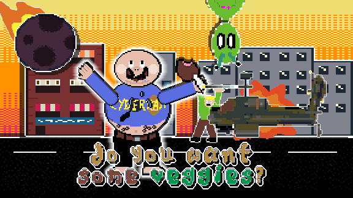

A small game that tells the incredible story of **Barry**, a ~~slightly~~ overweight man who should perhaps include some vegetables in his diet.

However, even though steel and rocks are not very appealing as snacks, our hero would much rather munch the chassis of a Boeing AH-64 Apache helicopter than a carrot, which in fact will lead him to some definitely astonishing events throughout the plot.

This game was developed for the [GMTK game jam 2024](https://itch.io/jam/gmtk-2024) in a total of 96 hours, so consider supporting it with a positive review and sharing it, it would make our day!

## Controls

<blockquote><b>Best played with a controller</b></blockquote>

<table><tbody><tr><td class="text-center"><strong>Key</strong></td><td><strong>Action</strong></td></tr><tr><td>A / LT / L2</td><td>Move left.</td></tr><tr><td>D / RT / R2</td><td>Move right.</td></tr><tr><td>W / RB / R1</td><td>Jump. (Also accelerate credits)</td></tr><tr><td>Left click /&nbsp;Left joystick</td><td>Control left arm.</td></tr><tr><td>Right click / Right joystick</td><td>Control right arm.</td></tr><tr><td>S / LB / L1</td><td>Descend (from level 4 onwards). (Also slow down credits.)</td></tr><tr><td>Space / Menu / Options</td><td>Pause. (Also skip credits.)</td></tr><tr><td>Esc / Change view / Select</td><td>Toggle full-screen.</td></tr><tr><td>Joypad left / Joypad right</td><td>Change language. (Only on title screen.)</td></tr></tbody></table>

## Source code
Be careful, this game was made in scarce time and under pressure (and coffee), so do not expect it to be neat and tidy, but rather like a scary mess that somehow works...

## Installation instructions
At the moment, “**do you want some veggies?**” is only available for Windows devices (aside from being playable on the web, of course), and the installation instructions are as follows:

1. Download the file “**do you want some veggies? — Windows**” and unzip it in whichever place you prefer.
2. Double click “**do you want some veggies**.exe” from the newly extracted folder.
3. Enjoy your game!

## License
This software is licensed under the [MIT license](LICENSE), except for the following assets:
* *'4 Chiptunes (Adventure)'* by SubspaceAudio.
* *'NES Shooter Music (5 tracks, 3 jingles)'* by SketchyLogic.
* *'War Pack'* by 2dGameCreation.
* *'City tilemap 32x32'* by AvKov.
* Sound effects imported from Myinstants.
* *'Realistic CRT shader'* by c64cosmin.
* *'JinxedWizards'* by Christina Antoinette Neofotistou.
* *'DoggoBark Serif'* by tavern-entering dog Studios.
* *'Credits Screen'* by MiDe.
